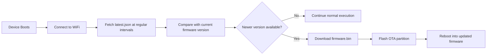
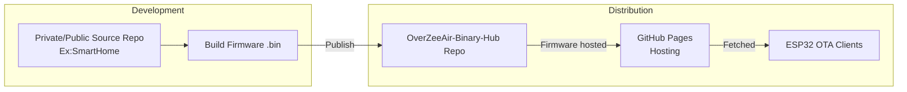

# OverZeeAir-Binary-Hub

> OverZeeAir-Binary-Hub is an OTA (Over-The-Air) firmware distribution server for ESP32 projects built with [OverZeeAir](https://github.com/ZamVak/OverZeeAir.git).

[OverZeeAir](https://github.com/ZamVak/OverZeeAir.git) is an ESP32 OTA framework — it equips your ESP32 project with the ability to receive and apply firmware updates Over-The-Air.

This repository serves as the centralized public endpoint where firmware builds from all OverZeeAir-powered projects are published and delivered to devices. Once a new firmware build is ready, it gets published here. ESP32 devices running OverZeeAir check this repository at runtime, compare versions, and pull the latest binary directly via GitHub Pages.

---

## Repository Structure

```
OverZeeAir-Binary-Hub/
└── projects/
    └── OverZeeAir/
        ├── update.json       ← version metadata (devices read this)
        ├── CHANGELOG.md      ← release history
        └── release/
            └── firmware.bin  ← compiled binary
```

This repository contains only compiled binaries and release metadata — no source code or build tooling.

---

## OTA Update Flow

When a device boots, it reaches out to this repository (via GitHub Pages) rather than the development repository to check for and download firmware updates.

**Update sequence on device boot:**



GitHub Pages serves this repository as a static file host, providing a stable and always-on firmware endpoint without the need for a dedicated server.

---

## Version Metadata (update.json)

Each project maintains a `update.json` file that devices use to determine whether an update is available and where to download it from.

```json
{
  "version": "1.1.0",
  "firmware_url": "https://<org>.github.io/OverZeeAir-Binary-Hub/projects/OverZeeAir/release/firmware.bin"
}
```

The device reads this file, compares the version string against its own, and decides whether to update. The binary URL is resolved dynamically — no hardcoded paths in firmware.

Future fields may include:

```json
{
  "version": "1.2.0",
  "firmware_url": "...",
  "sha256": "...",
  "channel": "stable",
  "mandatory": false
}
```

---

## Release process

New firmware is published here from the private/public source repository ([OverZeeAir](https://github.com/ZamVak/OverZeeAir.git)) after a successful build.

Steps:

1. New firmware compiled → `.bin` generated in source repo
2. Binary pushed to `projects/OverZeeAir/releases/`
3. `update.json` updated with new version and URL
4. `CHANGELOG.md` updated
5. Changes pushed → GitHub Pages updates automatically
6. ESP32 Devices discover the update by periodically checking the `update.json` file and pull the new firmware


---

## Architecture



This separation ensures that source code remains private while only the compiled release artifacts are exposed to devices.

---

## Multi-Project Support

The `projects/` directory is designed for multiple firmware channels:

```
projects/
├── OverZeeAir/
├── SmartHome/
└── ChemFlow-Vending Machine/
```

Each project directory manages its own `update.json`, binary releases, and changelog — all served from this same distribution infrastructure.
